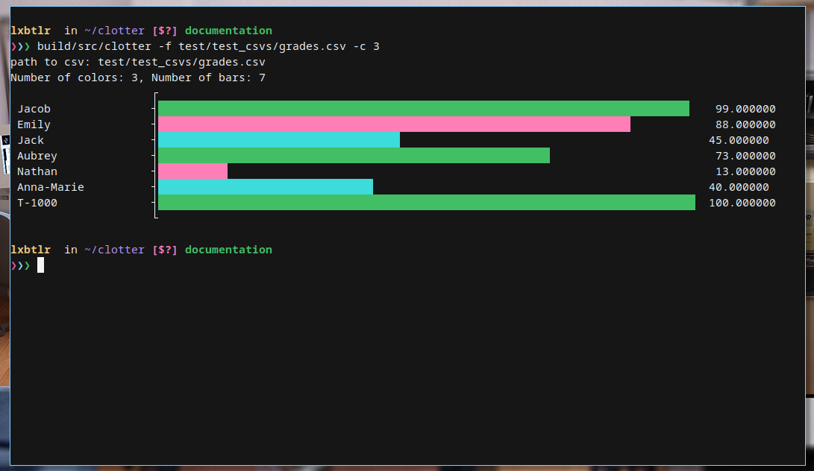

<div>
  <p align="center">
     
  </p>
</div>

# Clotter

Clotter is a terminal based plotter, written in C. Improve your efficiency by
quickly analyzing trends in data without booting up MatLab or writing a pesky
Python script.

## Dependencies

You will need the following on your system:

- Criterion >= 2.4.1
- A terminal capable of displaying TTF Unicode characters
- Ideally a monospaced font

## Installation

1. Clone this repo onto your machine:
```
git clone https://github.com/olincollege/clotter.git
```

2. Move into the directory and create a build directory:

```
cd clotter && mkdir build
```
3. Move into build directory, Cmake & make:
```
cd build && cmake ..
make
```

## Usage

Clotter comes with a number of flags to specify options:

- _-t_ specifies plot type (currently not used, due to only one plot type being available)
- _-f_ specifies file path, from the current directory
- _-c_ specifies the number of colors to use (somewhat dependent on how you have
  your terminal configured)

A call to clotter might look something like this:

`./clotter -f /path/to/file.csv -t countplot -c 3`

This should result in a graph that uses 3 terminal colors, like this:

<div>
  <p align="center">
     
  </p>
</div>

## Limitations
Some of our limitations are by design.
- This program was designed on Linux and is intended for use on Linux systems. You can maybe run it in other places, but YMMV and it's not tested.
- CSV data titles are limited to 20 characters by default. This is for terminal display purposes. This is a constant that can be adjusted in `constants.h`.

This is a student project, and there are some limitations that aren't by design.
- Error-handling in general is not quite there: for example, the count plot does not display negative values in an acceptable manner, but those are not handled or checked for.
- If you put quotes around the filename, the program segfaults.
- If you specify that there should be zero colors, the program segfaults.
- If a CSV data title has more than 20 characters (or whatever you changed the default to), the program segfaults.
- We want to include more plot types, but are currently limited to count plots.
